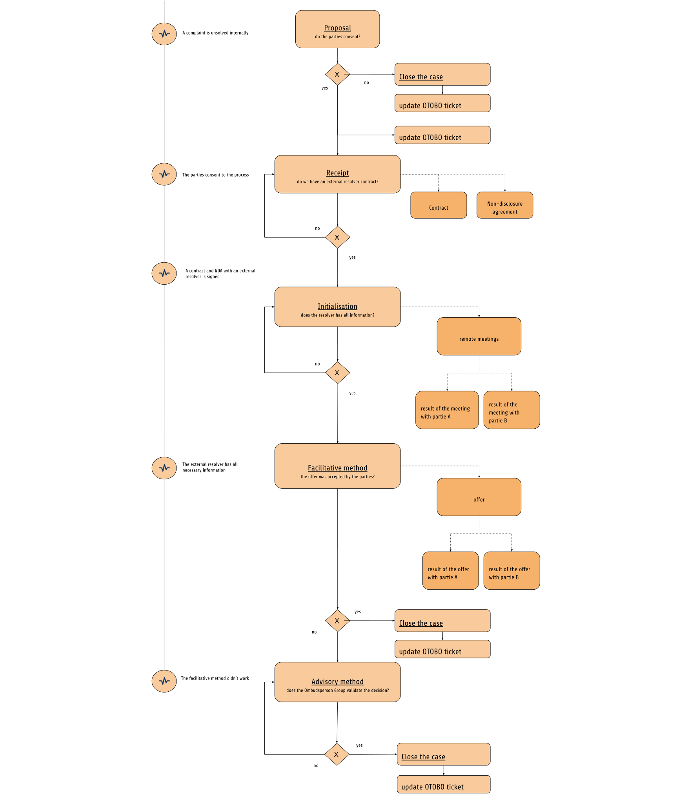

..  include:: /Includes.rst.txt
..  _dispute-resolution:

=========================
Dispute Resolution Policy
=========================

..  _dispute-resolution-goals:

Goals of the Dispute Resolution Policy
======================================

TYPO3’s Dispute Resolution Policy aims to provide guidance to plan, design, develop, operate, maintain and improve effective and efficient external dispute resolution for complaints. Dispute resolution provides a solution when the TYPO3 organization fails to solve a complaint internally. Most complaints can be successfully resolved within the organization, without the need for more time-consuming and confrontational procedures.

..  _dispute-resolution-definition:

Definition of a Dispute
=======================

Disagreement, arising from a complaint submitted to the TYPO3 organization.

The first expression of dissatisfaction made to the TYPO3 organization is a complaint. It is then handled by the :ref:`Complaint handling <complaint-handling>` process.  It becomes a dispute if not resolved by the organization internally.

..  _dispute-resolution-resolver:

Dispute resolver
================

Since dispute resolution takes place when a complaint cannot be resolved internally by the members of the Ombudsperson Group, the dispute resolver must be someone external to the TYPO3 organization.

Dispute resolvers should have the personal attributes, skills, training and experience necessary to discharge their responsibilities in a satisfactory manner.

The TYPO3 community is international. It is therefore possible that a dispute may arise between two parties from different countries and native languages. Depending on the situation, the dispute resolver will be selected to ensure the best conditions for communication between the parties.

..  _dispute-resolution-scope:

Applicability and scope
=======================

This document does not apply to disputes referred for resolution outside the organization or for TYPO3 Company employment-related disputes.

Only disputes within the :ref:`Applicability and Scope <coc-applicability-and-scope>` of the :ref:`Code of Conduct <coc>` are covered by this policy.

..  _dispute-resolution-consent:

Consent to participate
======================

Participation of the complainants in dispute resolution offered by the TYPO3 organization is voluntary. Consent to participate should be based on full knowledge and understanding of the process and possible outcomes.

..  _dispute-resolution-transparency-accessibility:

Transparency and accessibility
==============================

The dispute resolution process is communicated to TYPO3 Association members, TYPO3 Company employees, and other relevant interested parties. Individual complainants are provided with adequate information about the handling of their dispute.

The dispute resolution process is easily accessible to all complainants on the official TYPO3 websites. It details the steps about making and resolving disputes. The dispute resolution process and supporting information is easy to understand and use. The information is in clear language, in English, and if published on digital documents, in PDF/UA format, so that no complainants are disadvantaged.

Access to the dispute resolution process is free of charge to the complainant.

..  _dispute-resolution-fairness:

Fairness
========

The TYPO3 organization should engage in dispute resolution with the intent of fairly and honestly resolving the dispute with the complainant. The TYPO3 organization should select a provider whose dispute-resolution personnel and dispute resolvers engaged in dispute resolution are impartial and objective, so that processes, recommendations and determinative decisions are fair to both parties and are recognized as being made independently.

..  _dispute-resolution-responsive-timely:

Responsiveness and timeliness
=============================

Dispute resolution should be delivered as expeditiously as feasible, given the nature of the dispute and of the process used.

..  _dispute-resolution-confidentiality:

Confidentiality
===============

Personally identifiable information should be kept confidential and protected, unless disclosure is required by law, or consent for disclosure is obtained from the person concerned.

Similarly, trade secrets should be kept confidential and protected, unless disclosure is required by law, or consent for disclosure is obtained from the party that has the trade secret.

..  _dispute-resolution-resources:

Resources
=========

The TYPO3 Association should acquire and deploy resources such as personnel, information, materials, funding and infrastructure, so that it can effectively and efficiently select and pay an appropriate dispute resolver provider, contribute to the proper functioning of the provider, participate in the dispute-resolution process, and evaluate the performance of the provider, its resolvers, and the dispute-resolution process.

This resource’s allocated budget follows the same approval process as any TYPO3 official team and is reviewed annually. The ombudsperson group lead is the budget owner.

..  _dispute-resolution-process:

Dispute Resolution Process
==========================

The Dispute Resolution process starts when the TYPO3 organization fails to solve a complaint internally with the :ref:`Complaint Handling <complaint-handling>` process, and if the Ombudsperson group members decide that they should delegate to an external ombudsman.

