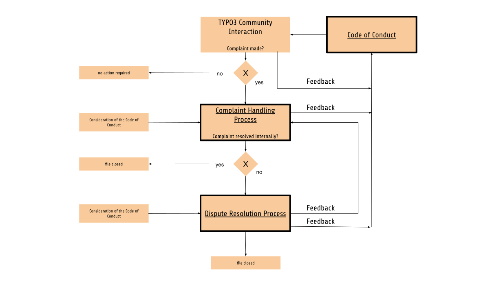

:navigation-title: Mediation Process
..  include:: /Includes.rst.txt
..  _mediation:

=================================
TYPO3 Community Mediation Process
=================================

The TYPO3 `Ombudsperson Group <https://typo3.org/community/teams/ombudsperson>`__ is responsible for ensuring the wellbeing of everyone in the community through education about and enforcement of the `Code of Conduct <coc>`. To provide arbitration and mediation and general help in conflict resolution, the TYPO3 Association must ensure an environment that is open to feedback (including complaints), resolving any complaints received.

To fulfill the community's expectations regarding conflict mediation, the Ombudsperson Group has set up a full Community Mediation Process, validated by the TYPO3 Association Board.

This process consists of two possible levels when aiming to resolve a conflict: a first level of internal resolution called the :ref:`Complaint Handling <complaint-handling>` Process, and if this is unsuccessful, a second level of resolution with the help of external mediation called the :ref:`Dispute Resolution <dispute-resolution>` Process.

